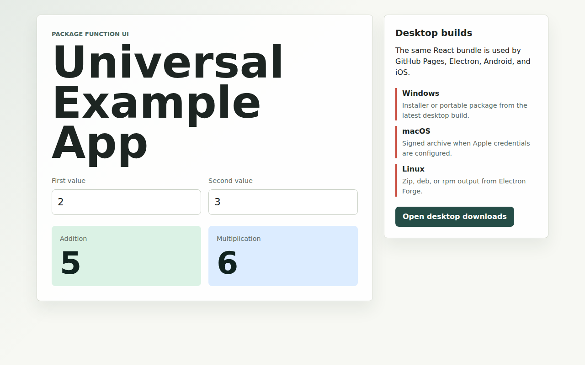

# Universal Example App

This example turns the package functions in `src/index.js` into a React UI and
uses the same build output for GitHub Pages, Electron desktop packages, and
Capacitor mobile projects.



> The preview image above is regenerated automatically on every push to `main`
> by the `preview-regen` job in `.github/workflows/example-app.yml`. Run it
> locally with `npm run example:web:preview-images`.

## Local Setup

```bash
npm install --prefix examples/universal-app
```

## Web

```bash
npm run example:web:dev
npm run example:web:build
npm run example:web:preview
```

The Vite config uses `./` as the default asset base so the bundle also works
when loaded by Electron or copied into Capacitor. In GitHub Pages CI,
`GITHUB_PAGES=true` switches the base path to `/<repository>/`.

## Desktop

```bash
npm run example:desktop:package
npm run example:desktop:make
```

`desktop:package` creates a local Electron package under
`examples/universal-app/out`. `desktop:make` creates distributable artifacts
for the current platform. The GitHub Pages UI links to the latest GitHub
release so users can download desktop packages once release artifacts are
published.

## Mobile

Capacitor native projects are generated by downstream applications when they
are ready to customize app identifiers, icons, signing, and store metadata.

Android:

```bash
npm --prefix examples/universal-app run mobile:android:add
npm run example:mobile:sync
npm --prefix examples/universal-app run mobile:android:run
```

iOS:

```bash
npm --prefix examples/universal-app run mobile:ios:add
npm run example:mobile:sync
npm --prefix examples/universal-app run mobile:ios:run
```

You can test locally without an Apple Developer Program account by running the
iOS app in an Xcode simulator. Physical iOS devices and App Store/TestFlight
submission require Apple signing credentials. Android emulator or physical
device testing does not require a Google Play Console account, while Play Store
submission requires the normal Google Play signing and service account setup.

The workflow includes gated Android and iOS build jobs. Set
`EXAMPLE_APP_ENABLE_ANDROID_BUILD=true` or `EXAMPLE_APP_ENABLE_IOS_BUILD=true`
as repository variables before enabling those native CI paths.
